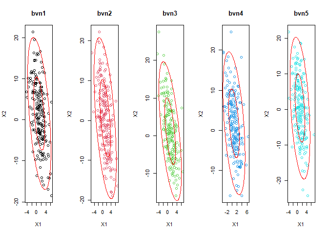
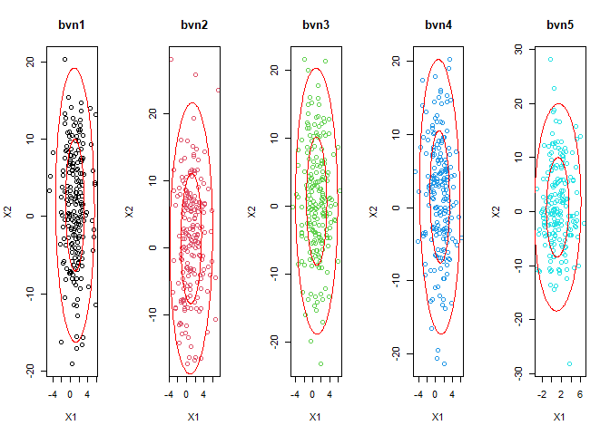
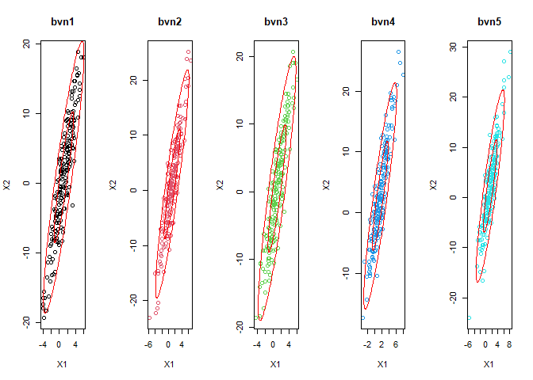

Tarea de Estadística Multivariante
================
Fernando Franco
6/8/2020

## Generación de datos que provienen de una distribución normal bivariante

Se definen los siguientes parámetros para la generación de las muestras:


Se usarán **5** distintos valores para el parámetro  :

  - \-0.9
  - \-0.5
  - 0
  - 0.5
  - 0.9

Los valores se generarán con 5 distintos métodos detallados a
continuación:

``` r
library(mvtnorm)
library(mixtools) 
N<-200
rho<- -0.9
mu1<-1
mu2<-1
s1<-2
s2<-8
 
#parámetros normal bivariante
mu<-c(mu1,mu2)
sigma<-matrix(c(s1^2,s1*s2*rho,s1*s2*rho,s2^2),2) 

#función ellipse
ellipse_bvn <- function(bvn, alpha){
  xbar <- apply(bvn,2,mean)
  s <- cov(bvn)
  ellipse(xbar, s, alpha = alpha, col="red")
}

library(MASS)
bvn1 <- mvrnorm(N, mu = mu, Sigma = sigma ) # from MASS package
colnames(bvn1) <- c("bvn1_X1","bvn1_X2")


M<-t(chol(sigma))
Z <- matrix(rnorm(2*N),2,N) # 2 rows, N/2 columns
bvn2 <- t(M %*% Z) + matrix(rep(mu,N), byrow=TRUE,ncol=2)
colnames(bvn2) <- c("bvn2_X1","bvn2_X2")

rbvn<-function(n, m1, s1, m2, s2, rho){
  X1 <- rnorm(n, mu1, s1)
  X2 <- rnorm(n, mu2+(s2/s1)*rho*(X1-mu1), sqrt((1-rho^2)*s2^2))
  cbind(X1, X2)
}

bvn3 <- rbvn(N,mu1,s1,mu2,s2,rho)
colnames(bvn3) <- c("bvn3_X1","bvn3_X2")


gibbs<-function (n, mu1, s1, mu2, s2, rho){
  mat <- matrix(ncol = 2, nrow = n)
  x <- 0
  y <- 0
  mat[1, ] <- c(x, y)
  for (i in 2:n) {  
    x <- rnorm(1, mu1+(s1/s2)*rho*(y-mu2), sqrt((1-rho^2)*s1^2))
    y <- rnorm(1, mu2+(s2/s1)*rho*(x-mu1), sqrt((1-rho^2)*s2^2))
    mat[i, ] <- c(x, y)
  }
  mat
}

bvn4 <- gibbs(N,mu1,s1,mu2,s2,rho)
colnames(bvn4) <- c("bvn4_X1","bvn4_X2")


bvn5 <- mvtnorm::rmvnorm(N,mu,sigma, method="svd")
colnames(bvn5) <- c("bvn5_X1","bvn5_X2")

bvn <- list(bvn1,bvn2,bvn3,bvn4,bvn5)

par(mfrow=c(1,5))
# plot(bvn1, xlab="X1",ylab="X2",main= "All Samples")
# for(i in 2:5){
#   points(bvn[[i]],col=i)
# }
for(i in 1:5){
  item <- paste("bvn",i,sep="")
  plot(bvn[[i]],xlab="X1",ylab="X2",main=item, col=i)
  ellipse_bvn(bvn[[i]],.5)
  ellipse_bvn(bvn[[i]],.05)
}
```

### Usando = -0.9

<!-- -->

### Usando = -0.5

<!-- -->

### Usando = 0

<!-- -->

### Usando = 0.5

<!-- -->

### Usando = 0.9

<!-- -->

### Interpretación

A medida que los valores de  varían entre \(-1\) y \(1\), se
puede observar como va cambiando la tendencia lineal de los datos además
de formarse elipses.
